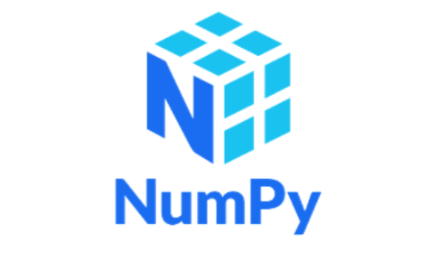

# Objetivo

Este notebook contém exercícios e explorações práticas sobre conceitos fundamentais da biblioteca NumPy, amplamente utilizada para computação numérica e manipulação eficiente de arrays em Python.

O objetivo deste estudo foi compreender:

- Manipulação de estruturas multidimensionais
- Leitura de dados externos
- Compreender as principais operações com arrays
- Desenvolver familiaridade com arrays NumPy
- Entender operações básicas e propriedades fundamentais
- Praticar leitura e manipulação de dados
- Aplicar conceitos matemáticos utilizando programação

---

## Conteúdo
1) Importação de dados
2) Propriedades de arrays
3) Comparação entre arrays
4) Indexação e seleção de dados

---

## Tecnologias

- Python
- NumPy
- Google Colab

---

Este material faz parte de um processo contínuo de aprendizado em Python para análise, ciência e engenharia de dados, com foco em desenvolvimento prático e consolidação de fundamentos matemáticos e computacionais.
