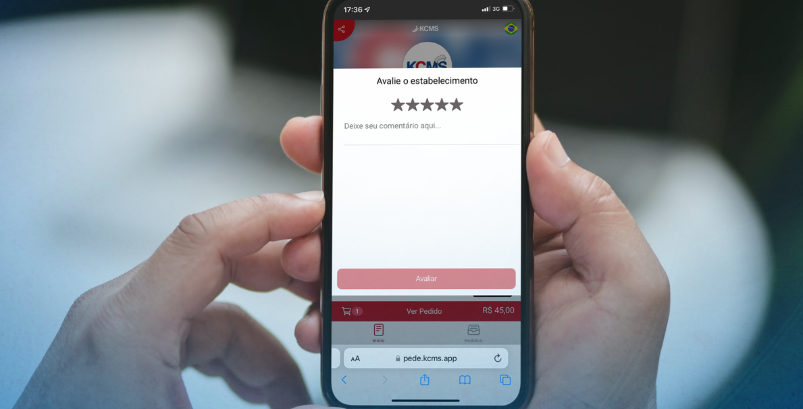

# Objetivo



Este projeto foi desenvolvido durante os estudos na ```Alura``` com o objetivo de praticar conceitos fundamentais de Programação Orientada a Objetos (POO) em Python.

---

## Conceitos aplicados

- Programação Orientada a Objetos (POO)
- Classes e instâncias
- Métodos de instância
- Métodos de classe (@classmethod)
- Atributos de classe
- Encapsulamento básico
- Organização de código em módulos

---

## Ferramentas
- Python 3.x
- VS Code
- Git / GitHub

---

## Aprendizado

Durante o desenvolvimento deste projeto, foi possível reforçar conceitos importantes como:

- A importância de estruturar bem o código
- Diferença entre atributos de classe e instância
- Organização de projetos Python em múltiplos arquivos
- Boas práticas de reutilização de código


