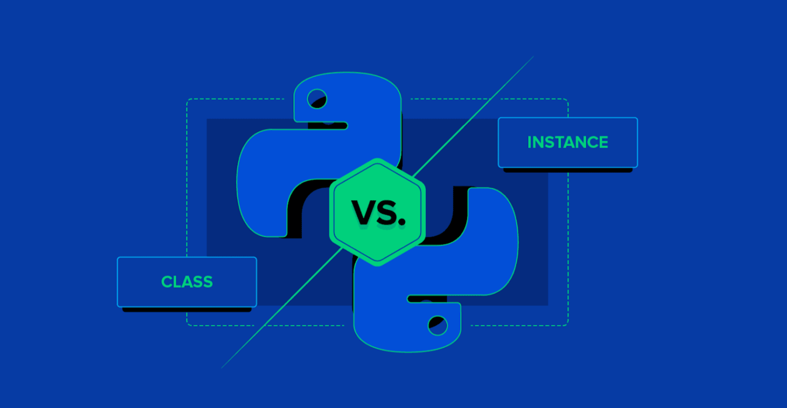

# Objetivo



Este repositório contém uma série de exercícios práticos com foco em Programação Orientada a Objetos (POO) utilizando Python. O objetivo é reforçar conceitos fundamentais como criação de classes, construtores, métodos especiais, propriedades e métodos de classe.

Este conjunto de exercícios tem como objetivo:

- Praticar os conceitos fundamentais de POO
- Entender a diferença entre:
- métodos de instância
- métodos de classe
- métodos especiais
- Aplicar boas práticas do Python (código mais "pythônico")
- Desenvolver organização e clareza na estrutura de código


# Como executar os exercícios

```bash
git clone https://github.com/jeduardosleite/Private-activities.git

cd Private-activities/python_oop/notebooks

code exercicio_1.py

code exercicio_2.py

code exercicio_2.py
```
